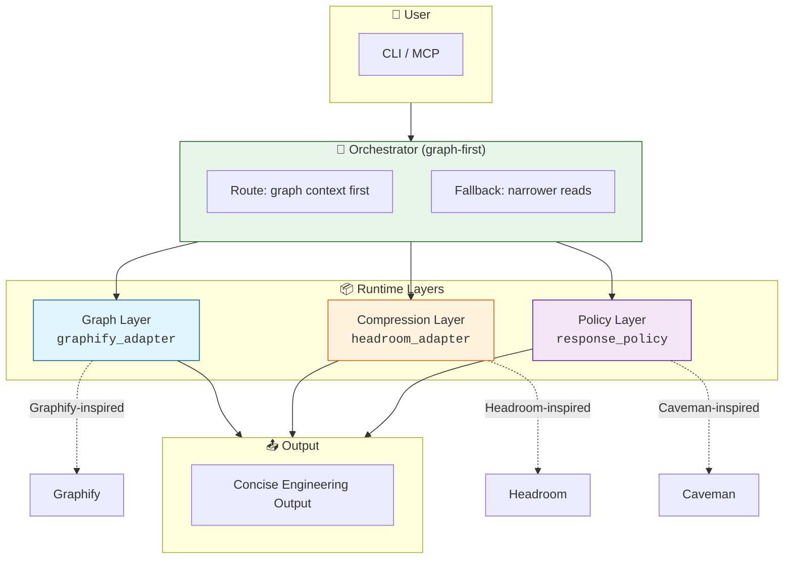

# Lithic

Lithic is a graph-first developer agent toolkit for understanding codebases, compressing context, and producing concise engineering output.

<p align="center">
  <a href="https://github.com/DelwarOfficial/Lithic"></a>
  <a href="https://github.com/DelwarOfficial/Lithic/commits/main"></a>
  <a href="LICENSE"></a>
  <a href="https://pypi.org/project/lithic/"></a>
</p>

<p align="center">
  <a href="#install">Install</a> •
  <a href="#quick-start">Quick Start</a> •
  <a href="#commands">Commands</a> •
  <a href="#platform-guidelines">Platform Guidelines</a>
</p>

[GitHub Repository](https://github.com/DelwarOfficial/Lithic)

Lithic brings together three complementary ideas in a clean adapter-based architecture:

- **Graphify-inspired graph intelligence** for codebase indexing, architecture mapping, and graph-guided exploration
- **Headroom-inspired compression** for large tool output, logs, JSON, and file reads
- **Caveman-inspired response policy** for concise review, commit, and coding-agent communication

Rather than merging upstream projects into one tangled codebase, Lithic keeps each capability behind a dedicated layer. That makes the system easier to understand, safer to evolve, and better suited for real repository work.

## Why Lithic

Coding-agent workflows usually break down in three places:

- they lose architectural context in large repositories
- they spend too many tokens on noisy tool output
- they answer too verbosely when short, actionable feedback is better

Lithic is designed to improve all three:

- **Graph-first orientation** before broad file scanning
- **Deterministic compression** before model-facing calls
- **Mode-aware response shaping** for review, commit, and concise workflows

## Quick Start

```bash
# Install Lithic
pip install lithic

# Build the project graph
lithic .

# Ask a question
lithic query "How does the GraphifyAdapter work?"

# Explain a concept
lithic explain "GraphifyAdapter"

# Show stats
lithic stats
```

## Commands

Lithic provides a unified `/lithic` command for all operations:

| Command | Description | Example |
|---------|-------------|---------|
| `lithic .` | Build graph from codebase | `lithic .` |
| `lithic query` | Ask questions about code | `lithic query "How does X work?"` |
| `lithic explain` | Explain a concept | `lithic explain "GraphifyAdapter"` |
| `lithic path` | Find path between nodes | `lithic path "A" "B"` |
| `lithic stats` | Show graph statistics | `lithic stats` |
| `lithic help` | Show help | `lithic help` |

### Short Alias

Use the short alias `lith` for faster typing:

```bash
lith .
lith query "How does X work?"
lith stats
```

## Platform Guidelines

### 🍏 Mac Users

#### Installation

```bash
# Install via pip (recommended)
pip install lithic

# Or via Homebrew (if available)
brew install lithic
```

#### Keyboard Shortcuts

| Action | Shortcut |
|--------|----------|
| Open terminal | `Cmd + Space` → type "Terminal" |
| Clear screen | `Cmd + K` |
| Cancel running command | `Ctrl + C` |
| Path autocomplete | `Tab` key |
| Command history | `↑` / `↓` arrow keys |

#### Common Issues & Fixes

- **Python version**: Ensure Python 3.12+ is installed (`python3 --version`)
- **Permission denied**: Use `sudo` with caution, or install with `--user` flag
- **Virtual environment**: Recommended to avoid dependency conflicts

```bash
python3 -m venv venv
source venv/bin/activate
pip install lithic
```

### 🪟 Windows Users

#### Installation

```powershell
# Install via pip (recommended)
pip install lithic

# Verify installation
lithic --version
```

#### Keyboard Shortcuts

| Action | Shortcut |
|--------|----------|
| Open terminal | `Win + R` → type "cmd" or "powershell" |
| Clear screen | `cls` (CMD) or `Clear-Host` (PowerShell) |
| Cancel running command | `Ctrl + C` |
| Path autocomplete | `Tab` key |
| Command history | `↑` / `↓` arrow keys |

#### Common Issues & Fixes

- **Python path**: Ensure Python is in your PATH environment variable
- **Long paths**: Enable long path support in Windows (registry or group policy)
- **Virtual environment**: Use PowerShell for best experience

```powershell
python -m venv venv
.\venv\Scripts\Activate
pip install lithic
```

### 🔧 Universal Guidelines

#### Pre-Installation Checklist

- [ ] Python 3.12+ installed
- [ ] `pip` is up-to-date (`pip install --upgrade pip`)
- [ ] Internet connection for first-time install

#### Troubleshooting

1. **Command not found**: Check if Python scripts directory is in PATH
2. **Permission errors**: Install with `--user` flag or use virtual environment
3. **Graph generation fails**: Ensure working directory has read/write access

## Features

- Build and refresh a project knowledge graph
- Ask architecture and codebase questions through Graphify-backed queries
- Explain symbols, files, modules, and relationships
- Find graph paths between concepts
- Compress large file, shell, log, and diff output safely
- Generate concise review output
- Generate Conventional Commit-style commit messages
- Expose core capabilities over MCP
- Support optional provider integrations for OpenAI, Anthropic, OpenRouter, and Ollama

## Architecture

Lithic is organized into three primary runtime layers coordinated by an orchestrator:



### Layer Responsibilities

| Layer | Module | Purpose |
|-------|--------|---------|
| **Graph** | `lithic.graph.graphify_adapter` | Codebase indexing, architecture mapping, graph-guided exploration |
| **Compression** | `lithic.compression.headroom_adapter` | Deterministic compression for large tool output, logs, JSON, and file reads |
| **Policy** | `lithic.policy.response_policy` | Mode-aware response shaping for review, commit, and concise workflows |

### Data Flow

1. **User input** enters via CLI or MCP
2. **Orchestrator** routes requests **graph-first**
3. **Graph layer** provides architectural context
4. **Compression layer** reduces token usage
5. **Policy layer** shapes the final response
6. **Concise output** is returned to the user

These layers are coordinated by `lithic.orchestrator`, which is intentionally **graph-first**. Broad codebase questions are routed through graph context before narrower reads or downstream actions.

## Resources

- [GitHub Repository](https://github.com/DelwarOfficial/Lithic)
- [Issues](https://github.com/DelwarOfficial/Lithic/issues)
- [Official Documentation](https://github.com/DelwarOfficial/Lithic/wiki)

## License

MIT

---

**Need help?** Provide your OS version and the exact error message for faster support.

More architecture details are available in [`docs/architecture.md`](docs/architecture.md).

## Installation

### Requirements

- Python 3.12
- [uv](https://github.com/astral-sh/uv)
- A shell environment such as PowerShell, Terminal, or Bash

### Install

```powershell
git clone https://github.com/DelwarOfficial/Lithic.git
cd Lithic
uv sync
```

### Optional Headroom extra

```powershell
uv sync --extra headroom
```

On some Windows environments, `headroom-ai` may require Rust/MSVC build tooling when a compatible wheel is unavailable. Lithic still works without that extra by falling back to its built-in deterministic compressor.

## Quick Start

Index the repository:

```powershell
uv run lithic index .
```

Ask an architecture question:

```powershell
uv run lithic ask "explain this project architecture"
```

Explain a symbol:

```powershell
uv run lithic explain "GraphifyAdapter"
```

Find a relationship path:

```powershell
uv run lithic path "GraphifyAdapter" "HeadroomAdapter"
```

Compress a large file:

```powershell
uv run lithic compress-file README.md
```

Review current changes:

```powershell
uv run lithic review
```

Generate a commit message:

```powershell
uv run lithic commit
```

Start the MCP server:

```powershell
uv run lithic mcp
```

## CLI Commands

| Command | Purpose |
| --- | --- |
| `lithic index .` | Build or refresh the project graph |
| `lithic ask "..."` | Ask a graph-guided codebase question |
| `lithic explain "..."` | Explain a symbol, file, module, or concept |
| `lithic path "A" "B"` | Find a graph relationship path |
| `lithic edit "..."` | Orient an edit task without mutating files |
| `lithic review` | Produce concise review findings from the current diff |
| `lithic commit` | Generate a Conventional Commit-style subject |
| `lithic compress-file <file>` | Compress large text output safely |
| `lithic stats` | Show graph and compression runtime stats |
| `lithic mcp` | Serve Lithic MCP tools over stdio |

## Configuration

Lithic reads configuration from environment variables and supports a local `.env` file.

Primary variables:

- `LITHIC_PROVIDER`
- `LITHIC_MODEL`
- `LITHIC_GRAPH_DIR`
- `LITHIC_RESPONSE_MODE`
- `LITHIC_VERBOSE`
- `OPENAI_API_KEY`
- `ANTHROPIC_API_KEY`
- `OPENROUTER_API_KEY`

Legacy `UDA_*` variables are still accepted as a compatibility fallback.

More setup details are available in [`docs/setup.md`](docs/setup.md).

## Safety

Lithic is designed to stay concise without becoming careless.

- Destructive shell patterns are refused unless explicitly approved
- Risky actions are shifted into clearer language instead of aggressive compression
- Code blocks, commands, file paths, and error strings are preserved exactly during response shaping and compression
- Original upstream repositories are not modified by Lithic itself

## Current Scope

Lithic is currently strongest as a **codebase understanding, compression, review, and commit-assist tool**.

Implemented today:

- graph-backed indexing and querying
- deterministic or Headroom-backed compression
- concise policy modes
- CLI and MCP surfaces
- optional provider wrappers

Not yet implemented:

- autonomous file-edit execution
- reversible decompression APIs
- full IDE/plugin packaging workflows

## Documentation

- [`docs/architecture.md`](docs/architecture.md)
- [`docs/setup.md`](docs/setup.md)
- [`docs/source-review.md`](docs/source-review.md)
- [`docs/merge-notes.md`](docs/merge-notes.md)
- [`docs/license-attribution.md`](docs/license-attribution.md)

## License and Attribution

Lithic includes adapter work and behavioral inspiration from:

- Graphify - MIT
- Headroom - Apache-2.0
- Caveman - MIT

See [`THIRD_PARTY_NOTICES.md`](THIRD_PARTY_NOTICES.md) and the [`LICENSES`](LICENSES) directory for details.
